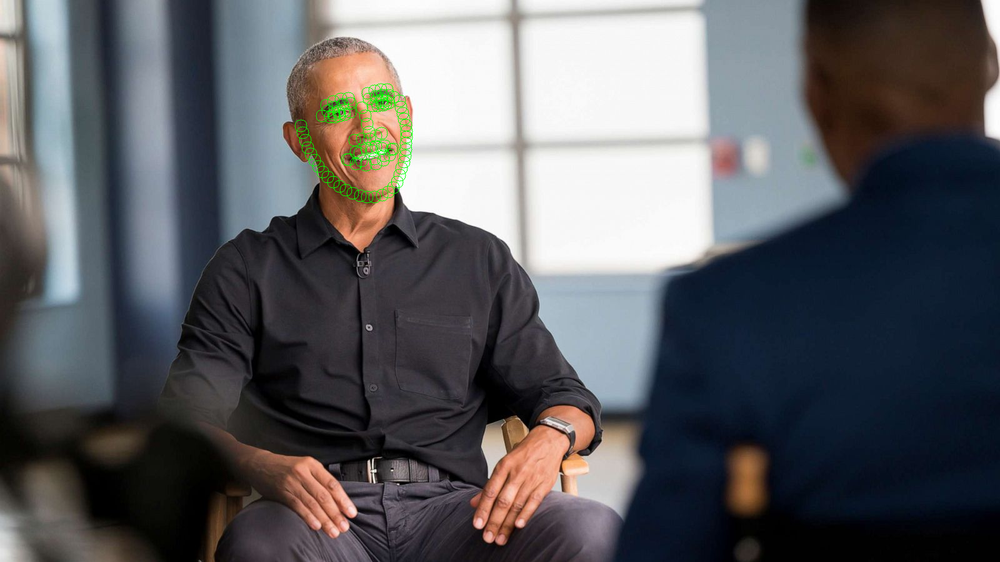
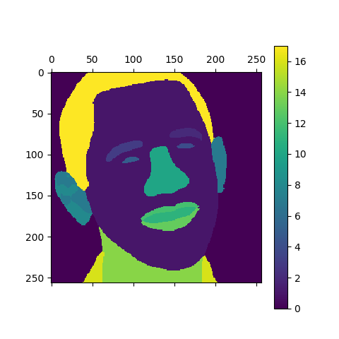

# LVT： Leslie's Version Tools
This is a playground of face algorithm.<br>
**You can find everything you want**<br>
If not, **just add it!!!**
| state | algorithm | source |
| :--: | :--: | :--: |
| ✅ |facial detector | [libfacedetection](https://github.com/ShiqiYu/libfacedetection.train)|
| ✅ |facial landmark|[SLPT](https://github.com/Jiahao-UTS/SLPT-master) |
| ✅ |facial id detector|[arcface](https://github.com/ronghuaiyang/arcface-pytorch) |
|✅  |facial gender classification|[fair face](https://github.com/dchen236/FairFace) |
| |facial attribute classification| |
| ✅|facial segemantation|[BiseNet](https://github.com/zllrunning/face-parsing.PyTorch) |
| |facial gaze estimation| |
| |facial Super-Resolution| |
### How to run
1. environment<br>
   ```shell
   git clone https://github.com/LeslieZhoa/LVT.git
   cd LVT
   pip install -r requirements.txt
   ```
2. download model<br>
    ```shell
    cd utils
    bash download_weight.sh
    ```
3. run<br>
   follow LVT.py and find details<br>
   ```py
   cd ../
   python LVT.py
   ```
### Show 
- origin image<br>
<br>
- crop image<br>

- align image<br>

- draw landmark<br>

- face parsing<br>
